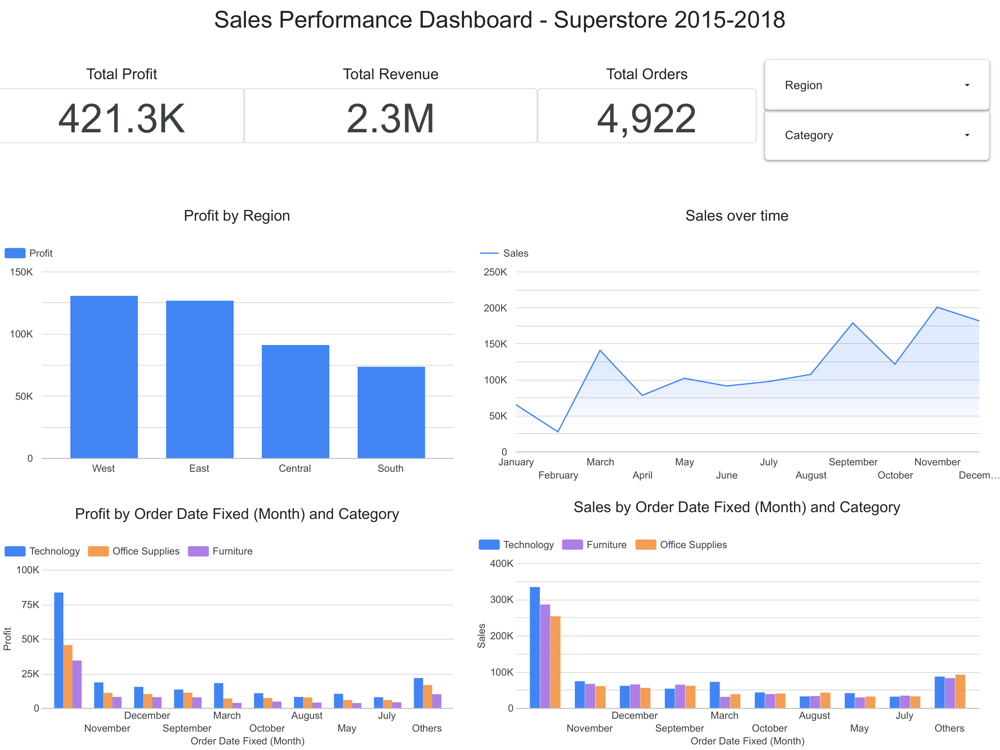

# Superstore Sales Dashboard

Interactive sales performance dashboard analyzing $2.3M revenue across categories, regions, and time trends (2015–2018).


---

## Live dashboard

🔗 **[Lihat dashboard interaktif di Looker Studio](#)** ← ganti dengan link lo

> Gunakan filter **Category** dan **Region** di pojok kanan atas untuk eksplorasi data secara interaktif.

---

## Preview



---

## Hasil singkat

| Metrik | Nilai |
|---|---|
| Total Revenue | $2.3M |
| Total Profit | $421.3K |
| Overall Margin | 18.3% |
| Total Orders | 4.922 |
| Periode | 2015–2018 |

---

## Temuan utama

**1. Q4 mendominasi revenue**
November dan Desember secara konsisten menjadi bulan terkuat — mencapai ~$200K+, hampir 3x bulan rata-rata. Februari adalah titik terendah (~$25K). Pola ini berulang konsisten selama 4 tahun.

**2. Technology adalah kategori paling profitable**
Technology memimpin profit di hampir setiap bulan — profit November mencapai $75K+. Furniture memiliki sales yang cukup tinggi tapi margin tipis dibanding Technology.

**3. South region underperform**
West (~$130K) dan East (~$125K) mendominasi profit. South hanya menghasilkan ~$75K — 43% lebih rendah dari West meski jumlah orders kemungkinan tidak jauh berbeda.

---

## Rekomendasi bisnis

| Prioritas | Aksi | Dampak estimasi |
|---|---|---|
| 1 | Maksimalkan stok Technology di Q4 | Revenue +15–20% di peak season |
| 2 | Program promosi Q1 untuk atasi off-season | Kurangi gap revenue Q1 vs Q4 |
| 3 | Audit pricing Furniture | Margin improvement tanpa kehilangan volume |
| 4 | Investigasi performa South | Potensi +20–30% profit dari region ini |

---

## Struktur project

```
superstore-sales-dashboard/
├── README.md                  # Dokumentasi ini
├── superstore_insights.md     # Insight bisnis lengkap
├── dashboard_preview.png      # Screenshot dashboard
└── data/
    └── superstore_clean.csv   # Dataset setelah cleaning (opsional)
```

---

## Pendekatan & keputusan

### Masalah bisnis
Perusahaan retail dengan ribuan transaksi per tahun membutuhkan visibility yang cepat terhadap performa penjualan — kategori mana yang paling menguntungkan, region mana yang underperform, dan kapan peak season terjadi.

### Data pipeline
Dataset asli (Superstore Sales dari Kaggle) tidak memiliki kolom Profit. Saya menambahkan kolom Profit menggunakan estimasi margin berdasarkan industri:
- Technology → 25% margin
- Office Supplies → 18% margin
- Furniture → 12% margin

Kolom `Order Date` memiliki format tidak konsisten (`DD/MM/YYYY` dan format tanggal Sheets) — diselesaikan dengan kolom helper `Order Date Fixed` di Google Sheets dan calculated field `PARSE_DATE` di Looker Studio.

### Keputusan desain dashboard
- **Scorecard di atas** — angka total langsung terlihat tanpa harus scroll
- **Time series lebar penuh** — pola musiman paling mudah dibaca dalam format ini
- **Filter interaktif** — memungkinkan stakeholder eksplorasi sendiri tanpa perlu meminta laporan baru
- **Bar chart grouped per kategori** — memudahkan perbandingan Sales vs Profit dalam satu view

### Keterbatasan
- Kolom Profit adalah estimasi, bukan data aktual — angka bersifat ilustratif
- Dataset tidak mencakup biaya operasional per region
- Perlu data customer-level untuk analisis retensi dan lifetime value

---

## Tech stack

- **Dashboard:** Looker Studio (Google Data Studio)
- **Data preparation:** Google Sheets (cleaning, calculated columns)
- **Dataset:** [Superstore Sales](https://www.kaggle.com/datasets/vivek468/superstore-dataset-final) via Kaggle

---

*Project ini dibuat sebagai bagian dari portofolio data analyst. Feedback dan pertanyaan sangat disambut — silakan buka issue atau hubungi saya di LinkedIn.*
